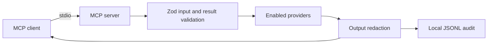

# prd-ops-lens-mcp

An MCP server can help an incident responder ask what happened across monitoring systems without switching between dashboards. This project builds that server as a local `stdio` process with bounded provider reads, a common evidence record, and a private audit log. It is designed so a cloned copy can start with no cloud account and enable only the providers its owner uses.

**Status:** Milestone A foundation is implemented. Provider queries, the demo stack, incident correlation, and the full incident eval suite are planned milestones; they are not available yet.

## The examined principle

Every tool result contains `data` and `examined`. The latter names the provider and query, records the time window and counts, and flags truncation or warnings. For example, a zero count is only meaningful alongside the query and window that produced it. The server validates this shape before returning a result and applies redaction to the result and audit record.



## Quickstart

Requires Node 22 or newer. This foundation example makes no provider calls.

```sh
npm ci
cp config.example.yaml config.local.yaml
npm run build
OPS_LENS_CONFIG="$PWD/config.local.yaml" npm start
```

The process waits for MCP messages on standard input. Standard output is reserved for MCP messages. Keep `config.local.yaml`, token files, and audit output outside the public repository for real integrations; `config.local.*` is ignored by Git.

## Tool catalog

| Tool | Current state | What it examines |
|---|---|---|
| `server_status` | Implemented | Validated local provider selection and limits; no network call |
| Grafana, Uptime, AWS, PostHog, Hostinger, timeline | Planned | Bounded provider reads and cited correlation |
| `plan_restart`, `restart_container` | Planned for local demo only | Exact allowlist, short confirmation token, cooldown, and audit |

Configuration is validated from the file named by `OPS_LENS_CONFIG`. Tokens are supplied through environment variables named in that file. Enabling any write tool will also require `OPS_LENS_ENABLE_WRITES=1`; live infrastructure will not be on the demo allowlist.

## Security model

The server starts with write actions disabled. Provider access is configured independently; the intended credential for each live provider is read scoped. Query windows, sizes, and timeouts are capped. Central redaction masks common identity fields and values, credentials, emails, and IP addresses. Each completed tool call writes one redacted JSON line to the configured local audit path. The server has no telemetry.

The official MCP TypeScript SDK v2 publishes the server package as `@modelcontextprotocol/server`; its v1 package name was `@modelcontextprotocol/sdk`.

## Verification

```sh
npm run lint
npm run typecheck
npm test
npm run evals
npm run build
npm audit --omit=dev
npm run secret-scan
```

The foundation replay currently has **1/1 evidence check** and **1/1 positive control**. It tests that a zero-row answer cites its query and window, and fails when the query evidence is removed. The planned incident suite will add 8–12 synthetic fault worlds and report its own scores when implemented. Unit tests enforce at least 90% line coverage on `src/` (excluding the process entrypoint). Local results do not establish GitHub CI or live provider behavior.

## Roadmap

1. Grafana, Prometheus, Loki, and a synthetic Docker demo.
2. Public uptime status and direct AWS reads with limited credentials.
3. PostHog, VPS provider reads, correlation, resources, and prompts.
4. Incident replay evals, permission guides, and a tagged release.

See [SECURITY.md](SECURITY.md) for reporting and [CONTRIBUTING.md](CONTRIBUTING.md) for the local check sequence.
