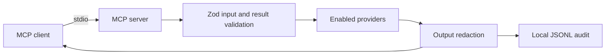

# prd-ops-lens-mcp

An MCP server can help an incident responder ask what happened across monitoring systems without switching between dashboards. This project builds that server as a local `stdio` process with bounded provider reads, a common evidence record, and a private audit log. It is designed so a cloned copy can start with no cloud account and enable only the providers its owner uses.

**Status:** The foundation, Grafana, Prometheus, Loki, public Uptime Kuma, CloudWatch, and IAM reads are implemented locally. A local Docker stack provides synthetic Grafana and uptime data for the demo. Direct AWS reads await a reviewed read-only profile. PostHog, Hostinger, incident correlation, and agent usage reports remain on the roadmap.

## The examined principle

Every tool result contains `data` and `examined`. The latter names the provider and query, records the time window and counts, and flags truncation or warnings. For example, a zero count is only meaningful alongside the query and window that produced it. The server validates this shape before returning a result and applies redaction to the result and audit record.



## Quickstart

Requires Node 22 or newer. With the example config, no provider is enabled.

```sh
npm ci --ignore-scripts
cp config.example.yaml config.local.yaml
npm run build
OPS_LENS_CONFIG="$PWD/config.local.yaml" npm start
```

The process waits for MCP messages on standard input. Standard output is reserved for MCP messages. Keep token files and the audit output outside the public repository for real integrations. For a real config, set `OPS_LENS_CONFIG` to its absolute path outside the repo and use an owner-only Grafana Viewer token file. The server checks Grafana permissions before it registers Grafana tools; see [Grafana permissions](docs/permissions/grafana.md).

To try the synthetic stack on your local Docker context:

```sh
docker compose up -d --build
npm run smoke:demo
docker compose down
```

The smoke test checks the demo services and calls the MCP dashboard, metric, and log tools over stdio. The demo API continuously emits synthetic metrics and logs, so returned row counts vary over time.

To exercise the real demo Kuma, open `http://127.0.0.1:3001` and finish its
first-run setup with a local admin credential. Add an HTTP monitor named
`Synthetic demo API` for `http://demo-api:8080/health`, then publish a status
page with slug `demo` containing that monitor. Run `npm run smoke:demo:uptime`.
The admin credential stays in the local Kuma volume; the MCP provider accesses
only the page's public JSON. If no page is published yet, the tool returns
`not_published`.

## Tool catalog

| Tool | Current state | What it examines |
|---|---|---|
| `server_status` | Implemented | Validated local provider selection and limits; no network call |
| `grafana_search_dashboards`, `grafana_alert_rules` | Implemented | Dashboard titles and alert state through read-only Grafana endpoints |
| `prometheus_instant`, `prometheus_range` | Implemented | Metric frames through Grafana `/api/ds/query`; range steps are at least 60 seconds |
| `loki_logs` | Implemented | Log frames through Grafana `/api/ds/query`, after a read-only index scan estimate |
| `uptime_status` | Implemented | Public status-page JSON, newest heartbeat, and safe incident summaries |
| `cloudwatch_metric_data`, `cloudwatch_alarms`, `cloudwatch_log_groups`, `cloudwatch_logs_insights` | Implemented locally | Bounded AWS metrics, alarms, configured log groups, and Logs Insights with scan accounting |
| `iam_whoami`, `iam_roles`, `iam_role_policies`, `iam_simulate_access`, `iam_analyzer_findings` | Implemented locally | Configured roles, trust shape, policy counts, one-action simulation, and external-analyzer findings |
| PostHog, Hostinger, timeline | Planned | Bounded provider reads and cited correlation |
| `plan_restart`, `restart_container` | Planned for local demo only | Exact allowlist, short confirmation token, cooldown, and audit |

Configuration is validated from the file named by `OPS_LENS_CONFIG`. Grafana credentials can come from its named environment variable or an owner-only token file. PromQL is capped at 2,000 characters and 200 returned series; LogQL is capped at 1,000 lines, a six-hour hard maximum, and 200-character regexes. The example config sets a tighter one-hour window. The optional `logCode` input builds a parsed-field match, `| json | logCode="VALUE"`, for structured logs. Enabling any write tool will also require `OPS_LENS_ENABLE_WRITES=1`; the restart tool is not implemented yet.

## Security model

The server starts with write actions disabled. Grafana startup checks the credential's permissions and refuses write-capable tokens by default. Every provider HTTP request must match an exact method and endpoint allowlist. Query windows, sizes, and timeouts are capped. Central redaction masks common identity fields and values, credentials, emails, and IP addresses. Each tool call writes one redacted JSON line to the configured owner-only audit path. The server has no telemetry. Tool output is marked as untrusted data.

Uptime Kuma uses only two [public status-page endpoints](docs/permissions/uptime.md). It never returns monitor URLs or page configuration. A missing or unpublished page returns `not_published`; incomplete or unreachable data remains `unknown`. Neither is reported as healthy.

CloudWatch requires a named profile in an owner-only credentials file. Startup checks the principal and simulates selected write actions before registering its tools. Logs Insights reads only configured groups, requires a final `| limit`, and stops a query that exceeds its scan cap or deadline. The [AWS permission guide](docs/permissions/aws.md) lists the needed actions. AWS identifiers are redacted by default.

IAM uses the same isolated credential-file rule, plus exact configured role names. It returns trust-policy shape and policy counts without full documents or condition values. Simulation reports `allow`, `deny`, or `unknown` and a matched statement reference. The [IAM permission guide](docs/permissions/iam.md) lists the read actions and their limits. No live IAM account check has been completed.

Loki's `/index/stats` response is an estimate and can exclude recent ingester data. The `examined` block identifies the estimate and reports returned lines separately. Do not interpret a zero-byte estimate as proof that no logs were scanned.

The official MCP TypeScript SDK v2 publishes the server package as `@modelcontextprotocol/server`; its v1 package name was `@modelcontextprotocol/sdk`.

## Verification

```sh
npm run lint
npm run typecheck
npm test
npm run evals
npm run guardrails
npm run build
npm audit --omit=dev
npm run secret-scan
npm run smoke:demo
```

The foundation replay has **1/1 evidence check** and **1/1 positive control** in the latest local run. It tests that a zero-row answer cites its query and window, and fails when the query evidence is removed. The planned incident suite will add 8–12 synthetic fault worlds and report its own scores when implemented. Unit tests enforce at least 90% line coverage on `src/` (excluding the process entrypoint). The [guardrail map](GUARDRAILS.md) links each active ID to a tagged test. Local results do not establish GitHub CI or live provider behavior.

## Roadmap

1. Validate CloudWatch and IAM against supplied, independently reviewed read-only profiles.
2. PostHog and VPS provider reads, correlation, resources, and prompts.
3. Incident replay evals, the gated demo restart, agent usage reports, and a tagged release.

See [SECURITY.md](SECURITY.md) for reporting and [CONTRIBUTING.md](CONTRIBUTING.md) for the local check sequence.
