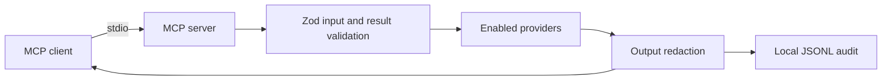

# prd-ops-lens-mcp

<p align="center">
  <a href="https://github.com/dehanz13/prd-ops-lens-mcp/actions/workflows/checks.yml"></a>
  <a href="#verification"></a>
  <a href="#verification"></a>
  <a href="#verification"></a>
  <a href="LICENSE"></a>
</p>

<hr>

<p align="center">
  
  
  
  
  
  
  <br>
  
  
  
  
  
</p>

An MCP server can help an incident responder ask what happened across monitoring systems without switching between dashboards. This project builds that server as a local `stdio` process with bounded provider reads, a common evidence record, and a private audit log. It is designed so a cloned copy can start with no cloud account and enable only the providers its owner uses.

**Status:** The foundation, Grafana, Prometheus, Loki, public Uptime Kuma, CloudWatch, IAM, PostHog, local incident correlation, local agent usage reports, and a Docker Desktop demo restart are implemented. A local Docker stack provides synthetic Grafana, uptime, and node-exporter data. Direct AWS reads await a reviewed read-only profile, and live PostHog reads await a project-scoped read-only key. There is no Hostinger provider in v1 because its personal tokens inherit the owner's permissions.

## The examined principle

Every tool result contains `data` and `examined`. The latter names the provider and query, records the time window and counts, and flags truncation or warnings. For example, a zero count is only meaningful alongside the query and window that produced it. The server validates this shape before returning a result and applies redaction to the result and audit record.



## Install locally

**Prerequisites:** A macOS or Linux computer (or Windows with WSL2), Node.js 22.13+ (Node 22 recommended; Node 24 or 26+ also supported) with npm, and Git. Plan for 4 GB RAM and 1 GB free disk for the local build; no GPU or cloud account is needed. Docker with Compose is optional for the synthetic demo. To use the server, your agent must support local stdio MCP servers.

1. **Clone and build.**

   ```sh
   git clone https://github.com/dehanz13/prd-ops-lens-mcp.git
   cd prd-ops-lens-mcp
   npm ci --ignore-scripts
   npm run build
   ```
2. **Create a private config.** The example starts with providers disabled, so no credential is needed yet. The config and token files must be owner-only regular files (`chmod 600`) with no links.

   ```sh
   mkdir -p ~/.config/prd-ops-lens-mcp
   cp config.example.yaml ~/.config/prd-ops-lens-mcp/config.yaml
   chmod 700 ~/.config/prd-ops-lens-mcp
   chmod 600 ~/.config/prd-ops-lens-mcp/config.yaml
   ```

   In that file, set `audit.path` to an absolute path in the same private directory before using real providers.

3. **Add a stdio server in your agent's MCP settings.** Use `command -v node` for the Node path and `realpath` for the two file paths below.

   | Setting | Value |
   | --- | --- |
   | Command | Output of `command -v node` |
   | Argument | Output of `realpath dist/index.js` |
   | Environment | `OPS_LENS_CONFIG` = output of `realpath ~/.config/prd-ops-lens-mcp/config.yaml` |

   Restart the agent and call `server_status`. For real providers, enable only the ones you need in the private config and follow the relevant guide in [docs/permissions](docs/permissions). Keep tokens and the audit file outside the repository. The server checks credentials before exposing provider tools.

### Optional synthetic demo

To try the data tools without cloud credentials, start the local Docker stack:

```sh
docker compose up -d --build
npm run smoke:demo
docker compose down
```

The smoke test checks the demo services and calls the MCP dashboard, metric, host metric, and log tools over stdio. The demo API continuously emits synthetic metrics and logs, so returned row counts vary over time. On Docker Desktop, node-exporter describes the demo's Linux VM, not the laptop host.

The [synthetic terminal cast](docs/demo.cast) is generated from a passing local smoke run with `npm run demo:record`. The recorder keeps only validated summary counts. See [demo steps](docs/demo.md) to reproduce it.

To exercise the real demo Kuma, open `http://127.0.0.1:3001` and finish its
first-run setup with a local admin credential. Add an HTTP monitor named
`Synthetic demo API` for `http://demo-api:8080/health`, then publish a status
page with slug `demo` containing that monitor. Run `npm run smoke:demo:uptime`.
The admin credential stays in the local Kuma volume; the MCP provider accesses
only the page's public JSON. If no page is published yet, the tool returns
`not_published`.

## Tool catalog

| Tool | Current state | What it examines |
|---|---|---|
| `server_status` | Implemented | Validated local provider selection and limits; no network call |
| `grafana_search_dashboards`, `grafana_alert_rules` | Implemented | Dashboard titles and alert state through read-only Grafana endpoints |
| `prometheus_instant`, `prometheus_range` | Implemented | Metric frames through Grafana `/api/ds/query`; range steps are at least 60 seconds |
| `loki_logs` | Implemented | Log frames through Grafana `/api/ds/query`, after a read-only index scan estimate |
| `uptime_status` | Implemented | Public status-page JSON, newest heartbeat, and safe incident summaries |
| `cloudwatch_metric_data`, `cloudwatch_alarms`, `cloudwatch_log_groups`, `cloudwatch_logs_insights` | Implemented locally | Bounded AWS metrics, alarms, configured log groups, and Logs Insights with scan accounting |
| `iam_whoami`, `iam_roles`, `iam_role_policies`, `iam_simulate_access`, `iam_analyzer_findings` | Implemented locally | Configured roles, trust shape, policy counts, one-action simulation, and external-analyzer findings |
| `posthog_hogql`, `posthog_insight`, `posthog_error_issues`, `posthog_flag` | Implemented locally | Bounded event queries and safe insight, issue, and flag summaries |
| Host health | Demo query available | `node_*` through Grafana; live exporter deployment is pending |
| Hostinger | Excluded from v1 | Personal tokens cannot prove zero write access |
| `incident_timeline` | Implemented locally | Orders events from this server's audited evidence IDs, cites each `examined` block, and marks absent expected sources unknown |
| `agent_usage_report`, `agent_usage_trend` | Implemented locally | Numeric usage fields from explicitly configured owner-only Codex and Claude transcript files; safe job labels, estimates, and weekly benchmarks |
| `plan_restart`, `restart_container` | Implemented for the local Docker Desktop demo only | Exact allowlist, two-minute single-use confirmation, kill and deploy locks, cooldown, before and after health, and audit |

Configuration is validated from the file named by `OPS_LENS_CONFIG`. Grafana credentials can come from its named environment variable or an owner-only token file. PromQL is capped at 2,000 characters and 200 returned series; LogQL is capped at 1,000 lines, a six-hour hard maximum, and 200-character regexes. The example config sets a tighter one-hour window. The optional `logCode` input builds a parsed-field match, `| json | logCode="VALUE"`, for structured logs. The [demo restart guide](docs/permissions/demo-restart.md) explains its separate startup flag and local host gates.

## Security model

The server starts with write actions disabled. Grafana startup checks the credential's permissions and refuses write-capable tokens by default. Every provider HTTP request must match an exact method and endpoint allowlist. Query windows, sizes, and timeouts are capped. Central redaction masks common identity fields and values, credentials, emails, and IP addresses. Each tool call writes one redacted JSON line to the configured owner-only audit path. The server has no telemetry. Tool output is marked as untrusted data.

Uptime Kuma uses only two [public status-page endpoints](docs/permissions/uptime.md). It never returns monitor URLs or page configuration. A missing or unpublished page returns `not_published`; incomplete or unreachable data remains `unknown`. Neither is reported as healthy.

Host and container health use the existing Grafana metric path. The [host-health query guide](docs/permissions/host-health.md) shows bounded `node_*` and `container_*` expressions and the evidence needed before calling a live exporter available. The MCP never loads a Hostinger token. The separate public Kuma JSON provides reachability; it does not infer host resource health.

The [incident timeline contract](docs/incident-timeline.md) describes how to pass server-issued evidence IDs into `incident_timeline`. It never queries a provider again and refuses caller-supplied result bodies. Optional system-map and runbook resources are read only from explicitly configured owner-only files. Triage, postmortem, and maintenance prompts carry the untrusted-data instruction and request read-only evidence.

The [agent usage guide](docs/agent-usage.md) explains the allowlisted local transcript parser, safe job labels, dated price tables, and privacy requirements for optional OpenTelemetry and PostHog exports. The MCP does not send usage events or load an Anthropic Admin API key.

CloudWatch requires a named profile in an owner-only credentials file. Startup checks the principal and simulates selected write actions before registering its tools. Logs Insights reads only configured groups, requires a final `| limit`, and stops a query that exceeds its scan cap or deadline. The [AWS permission guide](docs/permissions/aws.md) lists the needed actions. AWS identifiers are redacted by default.

IAM uses the same isolated credential-file rule, plus exact configured role names. It returns trust-policy shape and policy counts without full documents or condition values. Simulation reports `allow`, `deny`, or `unknown` and a matched statement reference. The [IAM permission guide](docs/permissions/iam.md) lists the read actions and their limits. No live IAM account check has been completed.

PostHog startup checks the active key's scopes and exact project bindings before registering any tools. Its HogQL tool accepts one event-only SELECT in a UTC window, applies a row limit, and returns safe scalar cells. The other tools return selected metadata instead of raw API objects. The [PostHog permission guide](docs/permissions/posthog.md) gives the key and endpoint contract. No live PostHog key has been supplied for verification.

Loki's `/index/stats` response is an estimate and can exclude recent ingester data. The `examined` block identifies the estimate and reports returned lines separately. Do not interpret a zero-byte estimate as proof that no logs were scanned.

The official MCP TypeScript SDK v2 publishes the server package as `@modelcontextprotocol/server`; its v1 package name was `@modelcontextprotocol/sdk`.

## Verification

```sh
npm run lint
npm run typecheck
npm test
npm run evals
npm run fixtures:lint
npm run guardrails
npm run build
npm audit --omit=dev
npm run secret-scan
npm run smoke:demo
```

The test, coverage, and audit badges show the 2026-09-28 local snapshot; the CI badge shows the latest pull request workflow. The `incident-replay-v1` suite scored **10/10 evidence checks** and **10/10 positive controls** in that local run. It replays ten handmade fault worlds through the MCP timeline tool and removes each case's key observation to check that scoring fails. This is an evidence availability score; model root-cause identification was not run. The fixture linter found zero violations in the synthetic fixtures and private denylist during local verification. CI runs its public pattern checks without the private file; the local exact-SHA gate requires the private check. Unit tests enforce at least 90% line coverage on `src/` (excluding the process entrypoint). The [guardrail map](GUARDRAILS.md) links each active ID to a tagged test. Local results do not establish GitHub CI or live provider behavior; inspect hosted checks on the exact PR head separately.

## Roadmap

1. Validate CloudWatch and IAM against supplied, independently reviewed read-only profiles.
2. Validate PostHog with a project-scoped read-only key; verify host and container exporters after an operator deploys them.
3. Prepare a release only after hosted checks pass on the release commit. Optional usage exports require separately scoped credentials and privacy checks.

See [SECURITY.md](SECURITY.md) and the [threat model](docs/threat-model.md) for reporting and trust boundaries, and [CONTRIBUTING.md](CONTRIBUTING.md) for the local check sequence.
